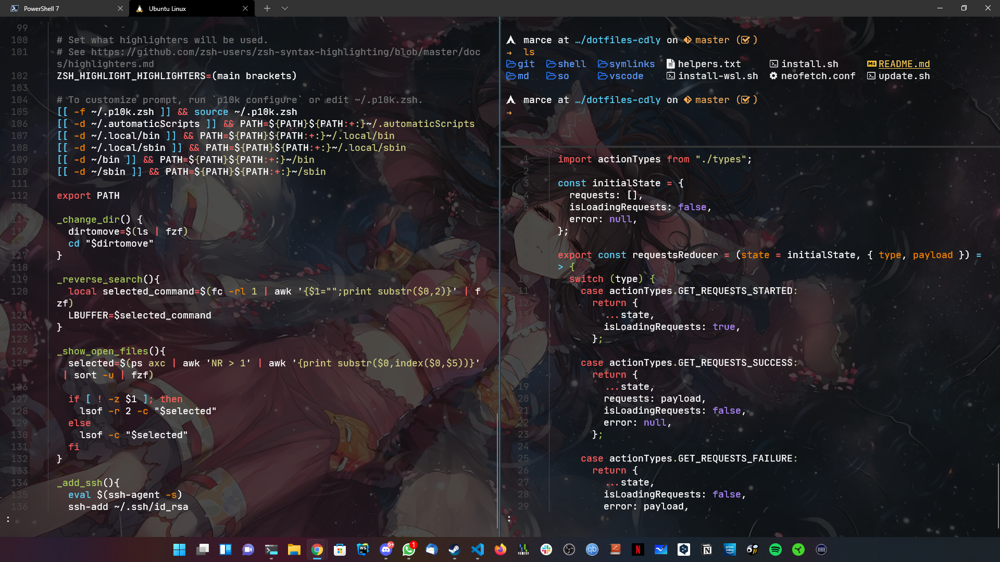
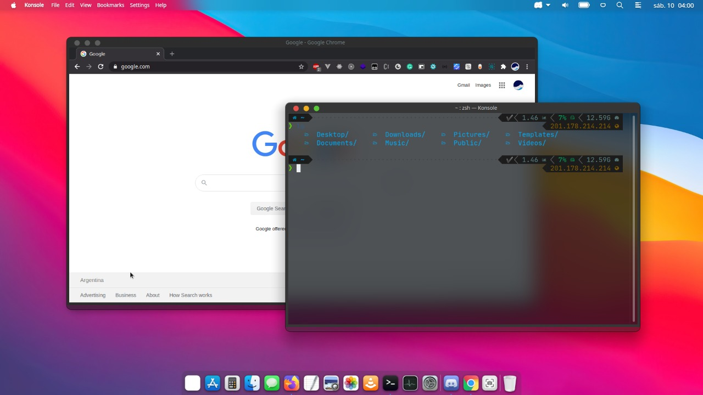

# dotfiles-cdly
Preview WSL2:

Preview KDE:


# Install

### PowrShell
If using SSH, and will contribute to the project, install using:
```
cd ~ && mkdir ~/.dotfiles-cdly && git clone git@github.com:marce-ldv/dotfiles-cdly.git .dotfiles-cdly && pwsh .dotfiles-cdly/install.ps1
```
If just using this scripts, install using:
```
cd ~ && mkdir ~/.dotfiles-cdly && git clone https://github.com/marce-ldv/dotfiles-cdly .dotfiles-cdly && pwsh .dotfiles-cdly/install.ps1
```
### BASH
If using SSH, and will contribute to the project, install using:
```
mkdir ~/.dotfiles-cdly && git clone git@github.com:marce-ldv/dotfiles-cdly.git ~/.dotfiles-cdly && bash ~/.dotfiles-cdly/install.sh
```
If just using this scripts, install using:
```
mkdir ~/.dotfiles-cdly && git clone https://github.com/marce-ldv/dotfiles-cdly ~/.dotfiles-cdly && bash ~/.dotfiles-cdly/install.sh
```
## Update all scripts and plugins
for update zsh with latest LOCAL modifications, use:
```
ushell
```
To update all repositories and update local configs, you can use:
```
pshell
```
## Aliases
```
alias uos='sudo apt update && sudo apt -y upgrade && sudo apt -y autoremove'
alias ushell='bash ~/.dotfiles-cdly/update.sh && omz update && omz reload'
alias pshell='cd ~/.dotfiles-cdly && git pull && bash ~/.dotfiles-cdly/update.sh && omz update && omz reload'
```